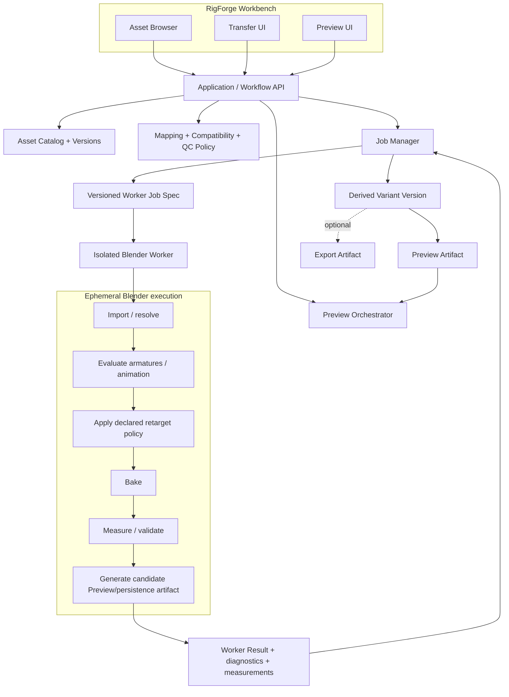

# V1 Blender-Backed Architecture Proposal

**Stage:** W0-SR — W0 Scope Revision  
**Status:** `REVIEW_PENDING`  
**Decision:** Blender as the V1 execution backend is
`PROVISIONAL_POC_GATED`, not accepted architecture yet.

## 1. Architecture hypothesis

RigForge should own the product workflow and its durable semantics. A pinned,
isolated Blender process should be evaluated as the first hidden execution
backend for import, detailed scene evaluation, retarget mechanics, baking,
and candidate Preview/persistence artifact generation.

Users do not operate Blender. Blender does not define Asset identity,
Skeleton Mapping, compatibility meaning, Retarget Policy, QC policy, Derived
Variant identity, or versioning.



The boxes inside “Ephemeral Blender execution” are implementation phases, not
product states and not Workflow Domain objects.

## 2. Ownership matrix

| Capability | RigForge owns | Blender owns for V1 | Derived / external | Future |
| --- | --- | --- | --- | --- |
| Asset metadata | Logical identity, type, origin, hashes, relationships | May extract observations | Source files remain external representations | Storage adapters |
| Versioning | Asset, Mapping, policy, Derived Variant, artifact lineage | Reports exact build/runtime | Immutable artifact bytes | Team/AMS integration |
| Mesh bytes/data | References and source hashes; no required full copy | Import/evaluation/export scene state | Source mesh bytes and generated representations | Native inspection/cook if justified |
| Skeleton Summary | Portable definition, provenance, required facts | Extracts/measures candidate facts | Rebuildable summary | Other inspector/worker |
| Source Skeleton binding | Motion-to-Skeleton reference | Resolves for execution | Source representation evidence | Other resolver |
| Bone Mapping | Correspondence, chains, evidence, confirmation, version | Translates Mapping to Blender operations | Worker projection is ephemeral | AI suggestions; host projections |
| Compatibility | Layer model, user-facing gate, final interpretation | Reports capability and measurements | Recomputable result | Other backend capabilities |
| Retarget Policy | Root, translation, proportion, twist/helper, chain/IK, bake intent | Executes supported mechanics | Versioned Job Spec | Other execution implementations |
| Transform evaluation | Declares required spaces/facts | Detailed source and animated evaluation | Worker measurements | Native/backend alternative |
| Constraints / IK | Policy and capability requirement | Constraint/IK implementation if enabled | Baked result | Native/Maya/custom solver |
| Baking | Sampling/loss policy | Evaluates and bakes | Derived animation | Other baker |
| QC | Meaning, checks, severity/policy, result interpretation | Can compute execution-local measurements | Validation/QC report | Independent verifier |
| Preview generation | Orchestration, required inspection data, provenance | Candidate mesh/skin/animation artifact generation | Preview Artifact is rebuildable | Dedicated generator |
| Viewer | Preview interaction and read-only display | None; no Blender UI required | Consumes Preview Artifact | Web/native renderer choice |
| FBX import / optional output | Capability/loss requirements; no required profile | Candidate V1 import and practical persistence output where needed | Source/output FBX is not authority | ufbx metadata; other writer |
| GLB generation | Candidate Preview/persistence artifact policy | Candidate generation path | Derived GLB if selected | Native writer if justified |
| Engine-specific export | No V1 requirement | None required | — | Optional future profile/integration |
| Job orchestration | Durable states, retries, cancellation, isolation, provenance | One process executes one Job Spec | Logs/temp/output staging | Cloud worker |

## 3. Product-level pipeline

```text
Resolve Character version
Resolve Motion version and Source Skeleton
Verify source hashes / availability
Acquire or refresh Skeleton Summaries
Resolve Mapping version
Run automatic Compatibility and Motion-suitability preflight
Expose Transfer directly when Ready
Request explanation/Mapping confirmation only on exceptions
Freeze Retarget Policy + Worker Job Spec
Queue isolated execution
Receive outputs, measurements, diagnostics
Run/interpret structural validation and QC
Generate or register Preview Artifact
Create Derived Variant version
Optionally register a practical output artifact when required
```

Illustrative product states:

```text
DRAFT
  -> PREFLIGHT
  -> AWAITING_CONFIRMATION | BLOCKED | READY
  -> QUEUED
  -> RUNNING
  -> VALIDATING
  -> SUCCEEDED_WITH_WARNINGS | SUCCEEDED | FAILED | CANCELLED
  -> PUBLISHED
```

Names are not frozen. A Blender sub-step such as “add constraint” must never
appear as the only durable product state.

## 4. Worker boundary

A worker receives a versioned, backend-neutral Job Spec. Candidate content:

- immutable source Asset Version references and content hashes;
- source Motion selector and Source Skeleton Reference;
- source and target Skeleton Summary versions;
- accepted Bone Mapping version and evidence hash;
- Retarget Policy version;
- expected worker capability profile;
- requested candidate Preview/persistence artifact settings;
- execution limits, temporary workspace, and output staging location;
- determinism/reproducibility context;
- common diagnostic and result envelope versions.

A worker returns:

- actual backend and build version;
- capability and configuration used;
- source hashes verified;
- execution phase outcomes;
- Mapping projection actually applied;
- bake/evaluation facts;
- QC measurements with units/spaces;
- structured diagnostics and declared losses;
- staged artifact hashes and metadata;
- terminal status.

The product accepts and publishes outputs only after validating this envelope.
Worker success alone cannot create a Derived Variant.

## 5. Minimum Blender process controls for the architecture PoC

POC-BLENDER-E2E-01 needs only enough process evidence to distinguish execution
success from failure and prevent automatic publication of partial output:

```text
one isolated process per job
pinned official Blender build
background mode
factory startup / isolated user configuration
automatic embedded-file script execution disabled
explicit Python exception exit code
structured stdout/result + captured log file
job-specific TEMP / workspace
staged output not published after non-zero/error result
no reuse of mutable interactive scenes
```

Official Blender command-line documentation exposes `--background`,
`--factory-startup`, `--disable-autoexec`, `--offline-mode`,
`--python-exit-code`, `--log-file`, user-resource environment variables, and
temporary-directory environment selection. It also states argument order
matters. These are mechanisms, not proof that the complete RigForge workflow
is deterministic.

Timeout/recovery campaigns, retry, cancellation, malformed envelopes,
concurrency/pooling, resource scheduling, upgrade rehearsal, and complete
packaging/distribution qualification belong to V1 worker integration,
hardening, and release qualification—not initial PoC acceptance.

## 6. Replaceability test

The design is insufficient if another backend would need to implement Blender
types in the product API.

```text
RigForge Retarget Policy
          |
          v
Backend capability negotiation
          |
     +----+------------------+
     |                       |
Blender Worker          Future Worker
Blender projection      Maya/native/cloud projection
     |                       |
     +---- common result ----+
```

Replaceability requirements:

1. Job Spec contains no `bpy` type, Blender datablock name as stable identity,
   Blender operator identifier as product policy, or `.blend` path as the only
   source identity.
2. Mapping is translated into a worker projection; the worker cannot author
   accepted Mapping truth.
3. Policy describes intent and required capability, not implementation steps.
4. Result/QC envelopes use backend-neutral meanings and explicit spaces/units.
5. Preview and export outputs are artifacts, not backend scene authority.
6. Capability negotiation allows a worker to reject unsupported policy before
   mutation.

## 7. Reconciliation with accepted DCC-independent research

Accepted W0.1–W0.4 said a DCC should not be a mandatory ingest dependency. The
clarified workflow creates a deliberate **proposal conflict**:

- old direction: native format adapters build a complete Canonical Domain
  without a DCC;
- proposed V1 direction: a managed Blender worker may be the only implemented
  execution/import/evaluation backend.

W0-SR does not rewrite the historical result or silently pretend there is no
conflict. If accepted after POC-BLENDER-E2E-01 and IA-1, the V1-specific rule
would become:

> Product semantics, catalog identity, Mapping, Compatibility, QC, Preview
> orchestration, and provenance must not depend on Blender's data model.
> V1 may depend operationally on a pinned hidden Blender worker for the first
> execution path, provided the worker boundary is replaceable and limitations
> are explicit.

Long-term DCC independence survives as a boundary property, not as a
requirement to ship multiple implementations in V1. Until W0-SR is accepted,
the existing rule remains in force and Blender is only a hypothesis.

## 8. Blender dependency risks and required mitigations

| Risk | Why it matters | Proposed control / evidence needed |
| --- | --- | --- |
| Version pinning | Import/export and Python behavior can change | Pin exact official build/hash; worker capability version; golden real-asset reruns |
| Headless gaps | UI operation may not work identically in background | Exercise complete E2E in `--background`; no manual UI steps |
| Python API stability | Official API has per-release change logs | Keep worker script narrow; pin; migration tests; no product semantics in `bpy` objects |
| Startup cost | Asset browsing/transfer latency and throughput | Measure cold/warm process cost; cache only derived summaries, not mutable scenes |
| Job isolation | One malformed asset or script must not poison another | One process/workspace per job initially; process timeout/kill; staged output |
| Crash isolation | Blender can terminate outside Python exception handling | Parent detects exit/crash; keeps logs; no publication; retry policy |
| Temporary files | Leaks, collisions, disk pressure, untrusted content | Per-job existing temp directory, quota, cleanup journal, content hashes |
| Reproducibility | DCC state, plugins, preferences, thread scheduling affect output | Factory/isolated config; explicit plugins; environment capture; semantic not byte determinism |
| Source scripts/security | `.blend` may contain scripts/drivers | `--disable-autoexec` by default; untrusted input sandboxing/OS controls require design |
| Format limitations | Blender importer/exporter may bake/drop semantics | Capability/loss preflight; POC corpus; preserve source; fail closed |
| Packaging/deployment | Blender is a large platform dependency | Evaluate official portable distribution, updates, platform support, disk footprint |
| Licensing | Blender is GPL; published `bpy` scripts/add-ons have obligations | Legal review before distribution; isolate process for architecture, not as claimed legal safe harbor |
| Worker concurrency | Blender Python integration is not thread-safe | Process-level concurrency; per-worker single main-thread Blender job; resource scheduler |
| CPU/GPU/resource use | Parallel jobs can exhaust workstation | Configured concurrency, memory/CPU limits, telemetry, cancellation |
| Determinism of IK/bake | Same inputs may vary by version/settings | Fixed frame/time policy, solver settings, dependency/build context; repeat-run semantic hashes/metrics |
| Preview coupling | Blender-generated preview could become de facto authority | Record it as derived; support regeneration/replacement; maintain inspection sidecar if needed |

The initial architecture PoC records these risks, exact versions, known
constraints, and future-review requirements. It does not close the complete
packaging, distribution, concurrency, recovery, or upgrade program. A material
blocker discovered early can still reject Blender; absence of one is not
shipping qualification.

### Official evidence used

Accessed 2026-08-31:

- Blender Command Line Arguments, official manual:
  https://docs.blender.org/manual/en/latest/advanced/command_line/arguments.html
  `[OFFICIAL_DOC]`
- Blender Scripting & Security, official manual:
  https://docs.blender.org/manual/en/latest/advanced/scripting/security.html
  `[OFFICIAL_DOC]`
- Blender Python API Change Log:
  https://docs.blender.org/api/current/change_log.html
  `[OFFICIAL_DOC]`
- Blender Python “Threads are Not Supported”:
  https://docs.blender.org/api/current/info_gotchas_threading.html
  `[OFFICIAL_DOC]`
- Blender Windows installation / portable distribution:
  https://docs.blender.org/manual/en/latest/getting_started/installing/windows.html
  `[OFFICIAL_DOC]`
- Blender License:
  https://www.blender.org/about/license/
  `[OFFICIAL_DOC]`

The Blender license page says Blender is GPL and that published scripts using
the Blender Python API must be GPL-compatible. It also permits commercial use
and says generated artwork belongs to its creator. Exact distribution,
communication, and worker-script obligations require legal review. Process
isolation is an engineering boundary, not a legal conclusion.

## 9. Preview architecture

V1 does not need a custom Character runtime merely to preview.

```text
Source Asset or Derived Variant
          |
          v
Preview Generator (Blender first candidate, replaceable)
          |
          v
Preview Artifact + inspection metadata
          |
          v
engine-independent read-only viewer
```

Derived GLB is a strong candidate for mesh/skin/playback portability, but this
proposal does not select GLB, Three.js, Babylon.js, WebGPU, or WebGL. If GLB is
used, Mapping/QC/loss overlays may require a companion payload. Preview must
remain rebuildable and must not require Blender at view time.

## 10. Decision record

| Decision | Class | Basis | Reversal |
| --- | --- | --- | --- |
| Product/worker boundary | `DECIDE_NOW` | `CLARIFIED_REQUIREMENT` + W0.3 | Only a product-model contradiction |
| Blender as sole implemented V1 backend | `PROVISIONAL_POC_GATED` | `ARCHITECTURAL_INFERENCE` + `NEEDS_POC` | E2E failure, durable Blender-semantic leakage, material semantic loss, or discovered legal/distribution blocker |
| One process per job initially | `PROVISIONAL_POC_GATED` | official threading warning + isolation needs | Measured process cost requires safe pool model |
| Product policy separate from execution | `DECIDE_NOW` | W0.2 + `ARCHITECTURAL_INFERENCE` | None; another worker still needs policy |
| Blender-generated Preview Artifact | `PROVISIONAL_POC_GATED` | `ARCHITECTURAL_INFERENCE` | Artifact coverage/performance fails |
| Viewer technology | `DEFER` | needs Preview PoC | Later evidence |
| Database/storage implementation | `DEFER` | no current evidence | Workflow scale/requirements |
| Native ufbx inspector | `DEFER` | POC-FBX evidence retained | Launch latency/metadata security/performance proves need |
| Native glTF stack | `DEFER` | Blender can generate candidate artifacts | E2E/Preview/export requires native path |
| Multiple execution backends | `DROP_FROM_V1` | `CLARIFIED_REQUIREMENT` | Strategic customer requirement |

## 11. Acceptance condition

This proposal must not be accepted solely because Blender has relevant
features. POC-BLENDER-E2E-01 must demonstrate one real cross-Skeleton workflow
using a frozen reviewed Mapping and Policy, a backend-neutral Job Spec,
ephemeral Blender projections, target bake, basic structural QC, explicit
Derived Variant provenance, one candidate Preview Artifact, fresh-process
re-open, clean-process semantic consistency, and observable success/failure.

Full non-humanoid E2E, Mapping quality, advanced QC, crash/timeout recovery,
concurrency, packaging completion, and output-profile breadth belong to V1
hardening. Failure of the minimal slice may require a richer Workflow Domain,
native inspection, a different backend, or rejection of the Blender-backed
hypothesis.
