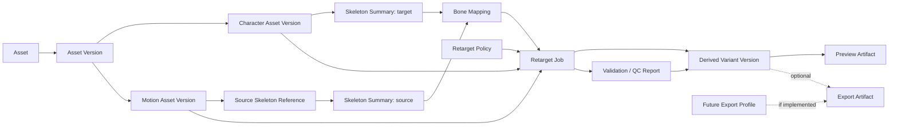

# V1 Workflow Domain Proposal

**Stage:** W0-SR  
**Status:** `REVIEW_PENDING`  
**Nature:** conceptual model, not production schema or API

## 1. Recommendation

V1 should own a **thin Workflow Domain**, not a complete in-memory replacement
for every source format or DCC scene.

The Workflow Domain preserves product identity, correspondence, policy,
diagnostics, provenance, and job state. Source bytes remain source
representations. Blender may evaluate detailed mesh, skin, constraint, and
animation semantics inside an isolated worker. Preview and export files remain
derived.

This is narrower than the earlier proposed Canonical Character/Skeleton/Motion
representation, but it is not “Blender is Canonical.” RigForge still owns the
meaning of the workflow and the evidence needed to reproduce it.

```text
Source representations                      RigForge authority
----------------------                      ------------------
FBX / GLB / .blend / later formats    --->  asset/version identity
                                              source Skeleton reference
                                              Skeleton Summary
                                              Mapping + evidence
                                              compatibility
                                              retarget policy
                                              job + execution record
                                              QC / validation meaning
                                              Derived Variant provenance

Blender scene / evaluated transforms  --->  ephemeral execution state
Preview / export files                --->  rebuildable derivatives
```

The thin-domain direction is `PROVISIONAL_POC_GATED`: it becomes the V1
architecture only if POC-BLENDER-E2E-01 proves the worker contract can execute
the product path without hidden Blender semantics leaking into product state.

## 2. Minimum concepts

Exact names, fields, serialization, and storage are open.

### Asset and Asset Version

**Why RigForge needs it:** the Asset Browser needs stable logical identity and
version history across source files and generated derivatives.

**Authority:** authoritative for RigForge catalog identity and relationships;
not authority for source-format semantics.

**References:** one or more immutable source representations, content hashes,
origin, version metadata, and derived summaries/artifacts.

**Does not own:** decoded mesh arrays, all source animation curves, a DCC scene,
or a game-engine object.

### Character Asset Version

**Why:** identifies a selectable target that already contains mesh, Skeleton,
and skin weights.

**Authority:** authoritative for which source representation/version the user
selected and for RigForge metadata.

**References:** source representation(s), Skeleton Summary, preview, validation,
and Derived Variants.

**Does not own:** a duplicate of all mesh and skin data merely to enter the
catalog. It is not a raw Static Mesh and not an Auto-Rig request.

### Motion Asset Version

**Why:** identifies a selectable clip and the Skeleton context required to
interpret it.

**Authority:** authoritative for RigForge clip identity, source binding, and
version relationship.

**References:** source representation, clip selector/name or stable source
location, Source Skeleton Reference, source time-domain and interval-derivation
provenance, source missing-channel/fallback semantics, metadata summary,
preview, and diagnostics. Any evaluated/sampled track cache is explicitly
derived and records the evaluation/bake policy and losses.

**Does not own:** a context-free collection of tracks or a full duplicate of a
shared source Skeleton. It must not silently equate FBX `FbxTime`, USD
TimeCode, and glTF seconds, or silently replace missing source channels with
identity transforms.

### Source Skeleton Reference

**Why:** several Motion Assets may share one Skeleton; generic retarget needs a
resolved source context.

**Authority:** authoritative for the RigForge binding/reference relation.

**References:** a Skeleton-bearing Asset Version and the summary extracted
under a recorded inspector/backend version.

**Does not own:** Blender armature objects or humanoid-only slots.

### Skeleton Summary

**Why:** UI, mapping, compatibility, and preflight need a portable,
backend-neutral inspection view.

**Authority:** **derived evidence**, not the original Skeleton authority.
Rebuildable from a source Asset Version under a recorded inspector/backend.

**References / candidate contents:** stable source-local joint keys, display
names, hierarchy, roots, rest/base-pose evidence, orientation evidence,
deforming/non-deforming/helper classifications, chain candidates, skin-binding
presence, units/axes, and extraction diagnostics. The summary or adjacent
inspection evidence identifies the declared rest source and keeps rest, bind,
inverse-bind, geometry-bind, and default transforms conceptually separable
without requiring complete copies of every source array.

**Does not own:** all mesh data, every skin weight, FBX pivot recipes, every
curve, full constraint networks, or animation evaluation. It must link to
source facts and report extraction loss.

### Bone Mapping

**Why:** mapping is a core reusable product asset. Automatic preflight uses it
on the happy path; the UI progressively discloses evidence, confirmation, and
editing only when needed or voluntarily requested.

**Authority:** authoritative for the accepted RigForge correspondence decision
and its evidence.

**References:** exact source/target Skeleton Summary versions and optional
semantic profiles.

**Does not own:** motion-distribution math or backend-native constraints.

It must represent more than `dictionary<string,string>`:

- joint-to-joint correspondence where valid;
- chain-to-chain correspondence with unequal member counts;
- source-only, target-only, optional, helper, twist, IK/control, end, and
  unmapped members;
- roles/profile namespace without requiring humanoid roles;
- mapping evidence: alias/name match, hierarchy, orientation/rest support,
  deform status, known profile, competing candidates, rule/model version;
- manual confirmation and overrides;
- future AI suggestions as non-authoritative candidates.

Names are evidence, not identity. Mapping correspondence is distinct from how
retarget motion is distributed across different chain counts.

### Compatibility Result

**Why:** the Transfer UI needs an explainable gate before execution.

**Authority:** derived product judgment for an exact Character, Motion,
Mapping, policy, and available worker capability context.

**References:** layered findings for mapping completeness, structural/semantic
compatibility, method/policy eligibility, Motion suitability, risks, blockers,
and confirmation requirements.

**Does not own:** final result acceptability or silently invented mappings.

Illustrative UX outcomes are Ready, Ready with warnings, Mapping confirmation
required, and Unsupported. Names are not frozen. Compatibility runs
automatically: Ready exposes Transfer directly; exception states expose
explanation and/or Mapping confirmation.

### Retarget Profile / Policy

**Why:** RigForge must own transfer intent even when Blender executes it.

**Authority:** authoritative product policy, versioned and backend-neutral.

**References / policy families:** mapping version, rest/base-pose alignment,
root and trajectory treatment, pelvis/central-body policy where applicable,
ordinary/special translation policy, proportion/scale policy, twist/helper
treatment, chain distribution, IK/constraint enablement and goals, bake/sample
policy, source missing-channel treatment, time-domain conversion, quaternion
normalization/continuity treatment, tolerances, and required worker
capabilities.

**Does not own:** Blender operator names, constraint node types, `bpy` objects,
or one universal retarget formula.

Minimum RigForge-owned logic includes validating that policy is internally
coherent, matching policy requirements to worker capabilities, computing or
checking backend-neutral structural facts, and interpreting QC. Detailed pose
evaluation, IK solving, and bake mechanics may remain in the worker.

### Retarget Job and Worker Job Spec

**Why:** one-click transfer requires durable orchestration, retries,
diagnostics, and reproducibility.

**Authority:** Retarget Job is authoritative for product-level state. The
Worker Job Spec is a versioned command derived from it.

**References:** immutable input versions, Mapping, policy, expected outputs,
backend capability/version, isolation parameters, and determinism context.

**Does not own:** an interactive Blender session or mutable absolute paths as
the only asset identity.

### Derived Variant and Derived Variant Version

**Why:** transfer output must be browsable, previewable, versioned, and
reproducible without duplicating logical Character identity.

**Authority:** authoritative for the RigForge derivation/provenance graph.

**References:** exact Character version, Motion version, Source Skeleton,
Mapping version, policy version, worker/backend version, execution record,
Validation Report, Preview Artifact, and optional Export Artifacts.

**Does not own:** an assumption that one exported FBX equals the complete
product object.

### Validation Report / QC Result

**Why:** Blender exit code 0 proves neither structural validity nor acceptable
motion.

**Authority:** authoritative for recorded RigForge checks and their policy
context; individual measurements may be computed by a worker.

**References:** structural checks, numerical checks, motion completeness,
root-trajectory signals, discontinuities, contact/foot-slide signals where
meaningful, severity, space/units, thresholds/policy, and evidence.

**Does not own:** universal artistic acceptance or silent correction.
The QC reporter must not silently run corrective IK or otherwise mutate the
result it is measuring.

Keep three layers distinct:

```text
structural validity
    != QC signals
    != production acceptability
```

### Preview Artifact

**Why:** both source assets and Derived Variants require click-to-preview.

**Authority:** derived and rebuildable.

**References:** source/Derived Variant version, preview generator/backend
version, declared losses, optional inspection sidecar/overlay payload.

**Does not own:** product identity, Mapping, QC thresholds, or source truth.

### Optional Export Artifact / Export Profile

**Why:** the domain should be able to register a derived persistence or
downstream representation when a concrete consumer requires one. Export is
not part of the mandatory Character → Derived Variant → Preview/version happy
path.

**Authority:** artifact is derived. A future profile is versioned product
policy only when implemented.

**References:** Derived Variant version, optional profile version,
backend/generator, losses, validation, content hash.

**Does not own:** Unreal/Unity/Godot runtime objects.

Multiple versioned Export Profiles are deferred / implementation-gated. No
engine-specific profile is required in the first Blender E2E.

## 3. Relationship diagram



## 4. Authoritative versus derived

| Item | RigForge authority | Derived/rebuildable | External authority |
| --- | --- | --- | --- |
| Logical Asset identity and versions | Yes | No | No |
| Source bytes and source-authored semantics | No | No | Source representation |
| Source Skeleton binding for Motion | Yes, as a catalog relationship | No | Source representation supplies evidence |
| Skeleton Summary | No | Yes | Source + extraction context |
| Accepted Bone Mapping and evidence | Yes | No | Host mappings are evidence/projections |
| Compatibility Result | Product judgment | Yes for exact inputs/policy | No |
| Retarget Policy | Yes | No | No |
| Blender scene/constraints | No | Ephemeral | Blender worker |
| Derived Variant provenance graph | Yes | No | No |
| Preview/Export Artifact bytes | No | Yes | No |
| QC policy and interpretation | Yes | Report is recomputable | Worker may compute measurements |

## 5. What V1 probably does not need to copy

Subject to POC-BLENDER-E2E-01, RigForge does not need to own complete copies of:

- mesh vertex/index/material payloads;
- every skin-weight array;
- every FBX-authored pivot, inheritance, and layer representation;
- every source animation curve/tangent;
- a full animation evaluator;
- a full constraint/IK graph;
- a complete DCC scene model.

Basis: `ARCHITECTURAL_INFERENCE` informed by W0.1/W0.3 and the clarified
workflow. POC-FBX-01 proves these facts are inspectable with ufbx, but does not
prove they must be persisted in a V1 Canonical model. Source files plus
content hashes preserve source authority; Blender can evaluate them for the
first execution path; portable summaries and explicit loss reports support UI
and policy.

Reversal condition: if E2E work shows repeatable mapping, compatibility, QC, or
backend replacement cannot be achieved without a richer product-owned
representation, expand the Workflow Domain only for the demonstrated facts.
Do not default back to a universal DCC clone.

## 6. Boundary invariants

1. Blender identifiers never become stable RigForge identities.
2. Worker output cannot create or alter an accepted Mapping without an
   explicit RigForge command.
3. Every worker run records source hashes, backend/build version, Job Spec
   version, policy, relevant environment/configuration, and diagnostics.
4. Capabilities and expected losses are checked before work starts.
5. Source and derived artifacts are visibly distinct.
6. Motion playback/retarget requires resolved source Skeleton context.
7. Humanoid profiles are optional mapping profiles, not the Skeleton model.
8. A future worker must be able to implement the Job Spec without pretending
   to be Blender.
9. Exact storage technology and production schema remain deferred.

## 7. AI boundary

AI may propose roles, correspondences, ambiguity rankings, or diagnostic
explanations. Each proposal records model/version and evidence. Deterministic
structure and user confirmation remain available. AI cannot silently accept
Mapping, mutate a Derived Variant lineage, or declare a result acceptable.

AI is `DEFER` for V1 necessity.

## 8. MCP and automation boundary

The same product-level job/domain API should eventually serve Workbench UI,
CLI, automation, and MCP. V1 architecture is not shaped around MCP. MCP is
`DEFER`; the reusable job API and headless worker are `DECIDE_NOW`.
