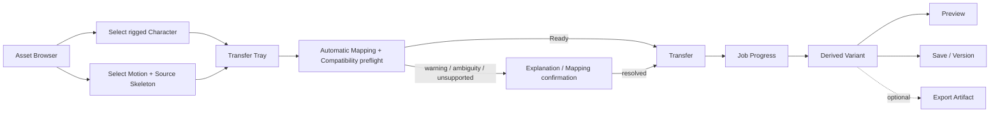

# W0 Scope Revision Proposal

**Stage:** W0-SR — W0 Scope Revision  
**Status:** `REVIEW_PENDING`  
**Date:** 2026-08-31  
**Purpose:** reconcile clarified product requirements with accepted W0 evidence
before further PoCs or implementation

This is the review entry point. It proposes a new V1 direction; it does not
rewrite W0.1–W0.4, POC-CORE-01, or POC-FBX-01.

## 1. Executive Summary

RigForge should narrow from a generic Character/Skeleton/Motion
infrastructure workbench to a **Character Animation Asset Workbench**. Users
browse assets, preview a rigged Character and a Motion with source Skeleton
context, receive automatic Mapping/Compatibility preflight, click Transfer,
and receive a previewable, versioned Derived Variant with QC and provenance.
Mapping detail is progressively disclosed only when warnings, ambiguity, or
policy require it. Export is an optional derivative.

The proposed V1 architecture owns a thin Workflow Domain rather than complete
copies of all mesh, skin, FBX transform, and animation-evaluation data. It
keeps Asset/Version identity, Skeleton Summaries, rich Bone Mapping,
Compatibility, Retarget Policy, orchestration, QC meaning, and derivation
provenance under RigForge authority.

Blender is proposed as a hidden, pinned, isolated V1 execution backend for
import, armature/animation evaluation, retarget mechanics, IK/constraints
where declared, baking, and artifact generation. Blender is not product
authority. This placement is `PROVISIONAL_POC_GATED` and must be tested by a
new POC-BLENDER-E2E-01 before implementation.

This refactor keeps engine independence and real-asset validation while
dropping V1 Auto-Rig, raw-mesh rigging, multiple DCC backends, direct engine
integrations, a mandatory native format stack, and a custom retarget runtime.

## 2. Why Scope Changed

The prior architecture reasonably optimized for an underspecified,
cross-format infrastructure platform. The clarified requirement now supplies
a concrete user transaction:

```text
rigged Character A + Motion B -> Transfer -> Derived Variant C
```

The target is never an unrigged mesh. Motion is meaningful only with source
Skeleton context. Generated results must be browsable and versioned. Preview
is part of both selection and result use. These constraints move product value
from “own every representation and runtime” to “own selection, Mapping,
policy, evidence, QC, provenance, and a reliable execution path.”

Basis: `CLARIFIED_REQUIREMENT`. The architectural consequence remains partly
`ARCHITECTURAL_INFERENCE` and therefore needs the Blender E2E PoC.

## 3. Clarified User Workflow



Character means mesh + Skeleton/armature + skin weights. It is conceptually
similar to an Unreal Skeletal Mesh, but no Unreal type or runtime is adopted.
The Ready path has no mandatory Mapping editor; advanced users may inspect or
edit Mapping voluntarily.

## 4. Old vs New Product Definition

| Area | Previous direction | Revised V1 direction | Why | Status / basis |
| --- | --- | --- | --- | --- |
| Product | Broad Character/Skeleton/Motion infrastructure workbench | Character Animation Asset Workbench | Concrete selection/transfer/result workflow | `DECIDE_NOW` / `CLARIFIED_REQUIREMENT` |
| Target input | Character model could imply broad asset construction | Already-rigged Character Asset | Target always has mesh, Skeleton, skin | `DECIDE_NOW` / `CLARIFIED_REQUIREMENT` |
| Motion | Canonical/unbound Motion emphasized | Motion version must carry/reference source Skeleton context for retarget | Tracks need a frame/hierarchy context | `DECIDE_NOW` / requirement + W0.1 |
| Generated result | Derived publish output | First-class Derived Variant with versions and provenance | Result must be managed and previewed | `DECIDE_NOW` / requirement + inference |
| Asset management | Minimal AssetReference/provenance | Asset Browser, versions, derivation graph are V1 core | Not UI decoration; central workflow | `DECIDE_NOW` / `CLARIFIED_REQUIREMENT` |
| Canonical | Heavy Canonical Character/Skeleton/Motion/Manifest | Thin Workflow Domain + source references + derived summaries | Blender can own execution detail | `PROVISIONAL_POC_GATED` / inference |
| FBX parser | ufbx primary V1 importer candidate | ufbx retained as a proven option; native inspector deferred until measured need | POC PASS does not imply shipping necessity | `DEFER` / `POC_EVIDENCE` + inference |
| glTF | Native parse/write Mandatory PoC | Preview/persistence artifact candidate; native stack not required now | Blender may generate derivative | `DEFER` native stack; artifact `PROVISIONAL_POC_GATED` |
| Retarget | RigForge-owned deterministic runtime | RigForge owns policy; Blender executes V1 mechanics/bake | Separate intent from execution | boundary `DECIDE_NOW`; backend `PROVISIONAL_POC_GATED` |
| Preview | Viewer over Canonical/Preview Projection | Derived Preview Artifact + engine-independent viewer | No custom Character runtime required for V1 | role `DECIDE_NOW`; technology `DEFER` |
| Engines / export | Generic Engine Adapter PoC and versioned profiles | Optional Export Artifact concept; multiple profiles deferred; direct integrations removed | No primary downstream export requirement is established | artifact concept `DECIDE_NOW`; profiles `DEFER`; integrations `DROP_FROM_V1` |
| DCCs | Optional adapters; no mandatory DCC ingest | One hidden Blender backend may be operationally required in V1 | Simpler first execution path | `PROVISIONAL_POC_GATED`; explicit historical-rule conflict |
| Auto-Rig | Future/non-core possibility | Explicitly outside V1 | Character already rigged | `DROP_FROM_V1` / `CLARIFIED_REQUIREMENT` |
| Core language | C++ preference gated by POC-CORE | Defer further | Thin domain + process boundary reduce urgency | `DEFER`; POC result remains `INCONCLUSIVE` |

## 5. Old vs New Architecture

```text
PREVIOUS
Formats -> native Adapters -> heavy Canonical Domain
        -> RigForge evaluation/retarget/QC -> Preview/Publish

PROPOSED V1
Asset Catalog + Workflow Domain + Mapping/Policy/QC/Provenance
        -> versioned Job Spec
        -> isolated Blender Worker
        -> Derived Variant
             + Preview Artifact
             + optional Export Artifact
```

The proposal deliberately reopens the accepted “DCC is never mandatory for
ingest” implementation rule. It does not falsify that history. Before W0-SR
acceptance, the old rule still applies. If the E2E PoC succeeds and the
revision passes IA-1, V1 may have a managed Blender operational dependency
while product semantics and the worker contract remain Blender-independent.

## 6. What RigForge Owns

- Product UX, Asset Browser, logical asset/version identities.
- Character, Motion, source Skeleton, and Derived Variant relationships.
- Portable, provenance-bearing Skeleton Summary requirements.
- Rich joint/chain Mapping, evidence, ambiguity, and user confirmation.
- Layered Compatibility and Motion suitability judgments.
- Backend-neutral Retarget Policy and capability requirements.
- Durable job states, Job Spec/result envelope, retries, cancellation.
- Structural validation, QC definitions/interpretation, and diagnostics.
- Derived-version provenance and artifact registration.
- Preview orchestration and the optional Export Artifact boundary.

RigForge does not need to own every decoded vertex, weight, pivot recipe,
curve, constraint, or evaluated pose in V1 unless PoC evidence proves a
specific product-owned fact is required.

## 7. What Blender Owns

Inside an ephemeral worker:

- source-format import supported by the pinned build;
- armature, transform, animation, constraint, and IK evaluation;
- translating an accepted Mapping/Policy into backend operations;
- retarget execution and bake;
- execution-local measurements;
- candidate Preview/persistence artifact generation.

Blender does not own stable identity, accepted Mapping, compatibility meaning,
policy intent, QC thresholds, Derived Variant identity, or publication.
Blender scene/data-block state is disposable.

## 8. What Is Removed from V1

```text
Auto-Rig
automatic Skeleton generation
automatic skinning
raw-mesh-to-rig workflow
full DCC editing
multiple execution backends
custom RigForge animation evaluator
custom RigForge retarget runtime (if Blender E2E passes)
mandatory native FBX/glTF/OpenUSD stack
direct Unreal/Unity/Godot integrations
runtime cook/compression system
MCP
mandatory AI mapping/retarget
```

The optional Export Artifact boundary, replaceable worker boundary, and
source/loss provenance preserve future handoff options. Multiple versioned
Export Profiles remain deferred until a concrete consumer requires them.

## 9. What Remains Open

Evidence—not design taste—must answer:

1. Can Blender execute the complete workflow reliably and repeatably on real
   different-Skeleton Character/Motion pairs?
2. Is the proposed Skeleton Summary sufficient for Mapping, Compatibility,
   QC, Preview, and backend replacement?
3. Which retarget policies/methods produce acceptable results for required
   humanoid and non-humanoid cases?
4. Is a generated GLB plus inspection sidecar sufficient for click-to-preview,
   or is another Preview Artifact needed?
5. Does Asset Browser latency justify a native ufbx metadata inspector?
6. Can Blender packaging and worker-script licensing be cleared?
7. Does a concrete downstream consumer require Export Artifacts or versioned
   Export Profiles in V1?

Database, UI toolkit, viewer library, exact schemas, and exact enum names are
deferred implementation decisions.

## 10. PoC / Roadmap Changes

| PoC | Revised placement |
| --- | --- |
| POC-GLTF-01 | `MERGE`: artifact/re-open lanes in Blender E2E + Preview; native stack deferred |
| POC-RETARGET-01 | `MERGE`: requirements preserved in POC-BLENDER-E2E-01 |
| POC-PREVIEW-01 | `REDEFINE`: click-to-preview using derived artifacts |
| POC-ENGINE-01 | `DOWNGRADE`: no direct Engine Adapter or engine-specific export requirement; any concrete artifact need is implementation-gated |
| POC-USD-01 | `DEFER` |

Next proposed high-information experiment:

```text
POC-BLENDER-E2E-01
real rigged Character
+ real Motion on a different source Skeleton
-> thin summaries + frozen reviewed Mapping + basic compatibility
-> isolated Blender retarget/bake
-> basic structural QC
-> Derived Variant
-> Preview Artifact
-> fresh-process re-open/verify
```

The first E2E tests execution architecture only. Automatic Mapping quality,
full non-humanoid E2E, fault/recovery campaigns, concurrency/pooling,
packaging qualification, advanced contact QC, artistic acceptance, and
multiple outputs move to V1 implementation/hardening. The contracts must
remain non-humanoid-capable, but this first result must not claim
non-humanoid E2E support.

Do not execute it until W0-SR external review.

Recommended gate:

```text
W0-SR accepted
+ POC-BLENDER-E2E-01
+ revised Preview PoC
+ revised W0 synthesis
-> IA-1 with a new independent Agent
-> implementation only if accepted
```

## 11. Risks

The main risk is trading architecture breadth for an unproven operational
dependency. Blender may introduce version/API churn, headless gaps, startup
cost, crash/temp-file isolation needs, import/export loss, packaging size,
concurrency/resource limits, and GPL/legal-review obligations. Factory startup,
disabled auto-execution, offline mode, process isolation, pinned builds, and
structured result envelopes are controls—not proof.

Other risks:

- a too-thin Skeleton Summary could force hidden Blender coupling;
- a too-rich summary could recreate the old Canonical model by accident;
- derived GLB may omit mapping/QC/FBX semantics;
- one-click UX may hide mapping ambiguity or result-quality limitations;
- Blender-success may be mistaken for QC success;
- a humanoid first path may accidentally hard-code humanoid roles;
- local-only catalog assumptions may not meet team versioning needs.

Detailed risk/mitigation ownership:
[V1_BLENDER_BACKED_ARCHITECTURE_PROPOSAL.md](../../architecture/V1_BLENDER_BACKED_ARCHITECTURE_PROPOSAL.md).

### Historical evidence disposition

| Evidence | W0-SR classification | Preserved value | Revised V1 implication |
| --- | --- | --- | --- |
| W0.1 Canonical Foundations | **partially relevant; retained as risk knowledge** | Rest/bind/IBM/default distinctions, FBX transform/layer complexity, time provenance, names != identity, format limits | A full Canonical copy is no longer presumed; source facts, summaries, loss, and backend tests must still respect these findings |
| W0.2 Mapping / Compatibility / Retarget | **still relevant** | Rich Mapping, layered Compatibility, policy-aware eligibility, root/pelvis/trajectory distinctions, QC and real-pair requirements | Becomes central product UX/policy; execution may move to Blender |
| W0.3 Adapter / Infrastructure | **partially relevant** | Adapter != authority, capability/loss/diagnostics, declared determinism context, derived Preview, process isolation | Broad adapter implementation is deferred; worker boundary and provenance survive; no-mandatory-DCC V1 rule is explicitly reopened |
| W0.4 Product / Tech Decisions | **partially superseded for V1; retained as option/risk research** | Library, preview, licensing, process, AI/MCP, and fallback evidence | Native format/Core/runtime rankings no longer determine critical path |
| POC-CORE-01 | **retained** | `COMPLETE / PASS`; equivalent slice evidence | Decision impact remains `INCONCLUSIVE`; Core language is deferred further |
| POC-FBX-01 | **retained as technical/evidence PASS and risk knowledge** | ufbx v0.23.0 behavior, guards, real humanoid/non-humanoid FBX evidence | Decision impact remains `KEEP_UFBX_WITH_GUARDS`; ufbx becomes a credible deferred inspector/optimization, not an automatic V1 importer mandate |

POC-FBX's technical/evidence acceptance is supplied by the clarified W0-SR
authority. At preflight its accepted repository files remained uncommitted and
its report still carried the pre-review lifecycle wording; W0-SR does not edit
that surface.

## 12. Decision Table

| Decision | Class | Basis |
| --- | --- | --- |
| Rigged Character is the V1 target | `DECIDE_NOW` | `CLARIFIED_REQUIREMENT` |
| Asset Browser and click-to-preview are V1 core | `DECIDE_NOW` | `CLARIFIED_REQUIREMENT` |
| Motion references source Skeleton context | `DECIDE_NOW` | `CLARIFIED_REQUIREMENT` + W0.1 |
| Derived Variant/version/provenance are first-class | `DECIDE_NOW` | `CLARIFIED_REQUIREMENT` + `ARCHITECTURAL_INFERENCE` |
| Mapping, Compatibility, Retarget Policy, QC remain product-owned | `DECIDE_NOW` | `CLARIFIED_REQUIREMENT` + W0.2 |
| Product/worker boundary | `DECIDE_NOW` | W0.3 + `ARCHITECTURAL_INFERENCE` |
| Thin Workflow Domain suffices | `PROVISIONAL_POC_GATED` | `NEEDS_POC` |
| Blender is the V1 execution backend | `PROVISIONAL_POC_GATED` | `NEEDS_POC` |
| Derived Preview Artifact is non-authoritative | `DECIDE_NOW` | W0.3 + requirement |
| GLB is the Preview Artifact | `PROVISIONAL_POC_GATED` | `NEEDS_POC` |
| Optional Export Artifact exists as a supported domain concept | `DECIDE_NOW` | `ARCHITECTURAL_INFERENCE` |
| Multiple versioned Export Profiles | `DEFER` | Concrete downstream consumer not established |
| Web viewer technology | `DEFER` | Preview PoC |
| Native ufbx inspector | `DEFER` | POC-FBX gives an option; need not ship |
| Native glTF stack | `DEFER` | No demonstrated V1 necessity |
| Core language | `DEFER` | POC-CORE impact `INCONCLUSIVE`; less urgent |
| Database/storage technology | `DEFER` | Product scale requirements unknown |
| Direct engine integration | `DROP_FROM_V1` | Accepted workflow has no engine dependency |
| Multiple execution backends | `DROP_FROM_V1` | Boundaries, not breadth |
| Auto-Rig / raw-mesh rigging | `DROP_FROM_V1` | `CLARIFIED_REQUIREMENT` |
| AI mapping suggestions | `DEFER` | Non-authoritative future aid |
| MCP | `DEFER` | Job API first |

## ASSUMPTIONS NO LONGER VALID

| Prior assumption | W0-SR assessment |
| --- | --- |
| RigForge V1 must own a full Canonical asset representation | Not justified for the clarified workflow; thin domain is PoC-gated |
| RigForge must natively parse every supported format | Invalid as a V1 necessity; worker can own first import path |
| RigForge must own animation evaluation | Invalid if Blender E2E proves controlled evaluation |
| RigForge must own a retarget runtime | Invalid if policy/worker separation passes |
| V1 must support multiple DCC backends | Invalid; one replaceable backend is enough |
| V1 needs direct engine adapters | Invalid; optional derived artifacts can be added for concrete consumers |
| Preview must consume full Canonical data | Invalid; derived Preview Artifact may suffice |
| Static/unrigged meshes are V1 transfer targets | Explicitly invalid |

## PRINCIPLES THAT SURVIVE THE REVISION

- Engine independence.
- Product-level format and backend independence.
- Source formats and Blender are not product authority.
- Authoritative versus derived separation.
- Mapping completeness != compatibility != method eligibility != result
  quality.
- Names are evidence, not identity.
- Rest, bind, inverse-bind, default transform, and retarget pose remain distinct.
- Silent semantic loss is forbidden.
- Determinism claims require a declared context.
- Real-asset and non-humanoid validation.
- Preview is derived, read-only, rebuildable, and engine-independent.
- Versioning and provenance.
- AI suggestions are non-authoritative.
- Independent audit before implementation.

### Final self-review

| Question | Answer |
| --- | --- |
| Designed for the clarified browse/select/transfer/preview/version workflow? | Yes; export is optional |
| Unnecessarily preserved old infrastructure? | No; native format breadth, runtime cook, engine adapters, MCP, and multi-backend implementation are deferred/dropped |
| Made Blender product authority? | No; it is an ephemeral execution adapter |
| Made product semantics Blender-inseparable? | No; backend-neutral Mapping, Policy, Job Spec, result/QC, and artifact boundaries are required |
| Assumed humanoid-only? | No; contracts are neutral and real non-humanoid E2E remains mandatory before release, not in the first architecture slice |
| Retained Auto-Rig? | No; explicitly out of V1 |
| Required native FBX/glTF parsers without evidence? | No; both are deferred pending measured need |
| Preserved Mapping / Compatibility / QC? | Yes; all are first-class product capabilities |
| Preserved engine-independent Preview? | Yes; derived artifact and independent viewer |
| Made Derived Variant/versioning first-class? | Yes |
| Replanned old PoCs instead of continuing mechanically? | Yes |
| Is POC-BLENDER-E2E-01 the highest-information next experiment? | Yes; the minimal slice can reverse the backend, domain thickness, and worker-boundary assumptions |
| Can an external reviewer understand the revision from this file? | Yes; companion files carry detail |

## 13. Recommendation

Accept W0-SR for focused external review, pause the original PoC sequence, and
design—but do not yet execute—POC-BLENDER-E2E-01. Do not freeze Blender,
GLB, a viewer stack, storage technology, or Core language from this proposal.

If the next PoC cannot keep Blender behind a backend-neutral contract or
cannot produce a useful, repeatable real cross-skeleton result, revise or
reject the Blender-backed hypothesis rather than expanding product claims.

Companion proposals:

- [V1 Product Scope Revision](../../product/V1_PRODUCT_SCOPE_REVISION_PROPOSAL.md)
- [V1 Blender-Backed Architecture](../../architecture/V1_BLENDER_BACKED_ARCHITECTURE_PROPOSAL.md)
- [V1 Workflow Domain](../../architecture/V1_WORKFLOW_DOMAIN_PROPOSAL.md)
- [Roadmap Scope Revision](../../development/ROADMAP_SCOPE_REVISION_PROPOSAL.md)
- [W0-P Replan](../poc/W0P_REPLAN_PROPOSAL.md)
